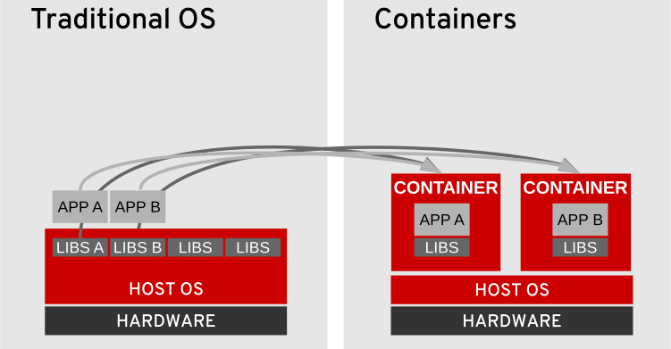
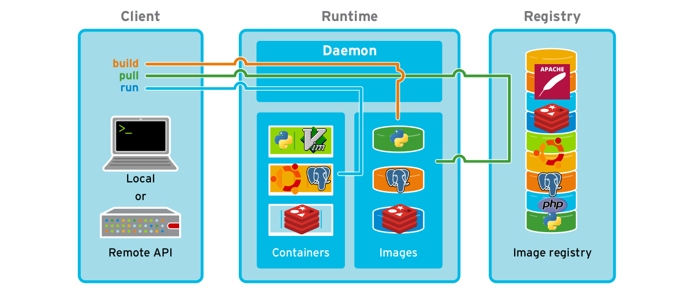

# Introducción al desarrollo con Docker

Tradicionalmente hemos desarrollado las aplicaciones como un único conjunto de *librerías*, archivos de configuración y servicios en ejecución, tales como una base de datos o un servidor HTTP. Estos procesos los ejecutamos sobre nuestra máquina local o, en algunos casos, sobre una máquina  virtual.

El mayor inconveniente de esta arquitectura es que está unida al entorno en ejecución y cualquier actualización o instalación de terceras aplicaciones pueden afectar al normal desarrollo de la aplicación. 

Para salvar esta situación podríamos usar máquinas virtuales, las cuales nos proporcionan un entorno completamente funcional donde ejecutar nuestras aplicaciones sin interferencias. El problema de usar máquinas virtuales es el tiempo que tardan en iniciarse, así como la cantidad de recursos que pueden llegar a consumir.

Como alternativa a estas dos opciones surgen los contenedores. Los contenedores nos dan por un lado la inmediatez de trabajo que nos puede dar nuestra máquina local, como el aislamiento de los procesos que nos daban las máquinas virtuales.



## Ventajas de usar contenedores

El uso de contenedores no solo nos ayuda con la eficiencia, elasticidad o reutilización de nuestras aplicaciones. También nos ayudan a tener una plataforma portable con nuestras aplicaciones.

Algunas de las ventajas más destacables son:

* Bajos recursos de Hardware
* Entorno de trabajo aislado
* Rápido despliegue
* Múltiples entornos de desarrollo
* Reutilización
* Utilización de arquitecturas de microservicios


## Conceptos fundamentales de Docker

Docker es un software que automatiza el despliegue de aplicaciones dentro de contenedores de software, proporcionando una capa adicional de abstracción y automatización de virtualización de aplicaciones en múltiples sistemas operativos.

Algunos conceptos fundamentales son:

- **Imagen**:  Es un modelo de lo que quieres construir. Ejemplo: Ubuntu + Apache + php + MySQL.
- **Contenedor**:  Es una instanciación de una imagen. Puede tener varias copias de la misma imagen en ejecución.
- **Dockerfile**: Receta para crear una imagen. Los Dockerfiles contienen una sintaxis especial de Docker. Es un documento de texto que contiene todos los comandos que un usuario puede utilizar para ensamblar una imagen. 
- **Commit**: Al igual que Git, los contenedores Docker ofrecen control de versiones. Puede guardar el estado de su contenedor Docker en cualquier momento **como una nueva imagen**, y añadiendo una **nueva capa**.
- **DockerHub / Image Registry**: Lugar donde la gente puede publicar imágenes de docker públicas (o privadas) para facilitar la colaboración y el intercambio.
- **Layer**:  modificación de una imagen existente, representada por una instrucción en el Dockerfile. Las capas se aplican en secuencia a la imagen base para crear la imagen final.


## Arquitectura de Docker



Tenemos tres partes bien diferenciadas que nos permite un mayor control sobre lo que está sucediendo en nuestro entorno de trabajo.

* **Docker client**: Es la herramienta, en línea de comandos, responsable para comunicarnos con el servidor docker. La comunicación se lleva a cabo mediante una RESTful API a la cual solicitamos operaciones.

* **Docker Runtime o Server**: Este servicio, que se ejecuta como un demonio en un sistema operativo, hace el trabajo pesado de construir, ejecutar y descargar imágenes de contenedores. El demonio puede ejecutarse en el mismo sistema que el cliente docker o de forma remota. 

* **Docker Registry or Image Registry**: Los registros almacenan imágenes para uso público o privado. El conocido registro público es Docker Hub, y almacena múltiples imágenes desarrolladas por la comunidad, pero se pueden crear registros privados para apoyar el desarrollo de imágenes internas.


### Comandos comunes

| Comando           | Descripción                                          |
| ----------------- | ---------------------------------------------------- |
| docker version    | Información sobre la instalación realizada           |
| docker run        | Crea un contenedor a partir de una imagen            |
| docker ps         | Lista de contenedores en funcionamiento              |
| docker inspect    | Información acerca de un contenedor o imagen         |
| docker start/stop | Arranca o para un contenedor                         |
| docker rm/rmi     | Borra un contenedor (rm) o borra una imagen (rmi)    |
| docker cp         | Copiar ficheros de dentro de un contenedor (lanzado) |
| docker exec       | Ejecuta comandos dentro de un contenedor             |
| docker logs       | Nos da información (logs) acerca de un contenedor    |
| docker stats      | Estadísticas de los contenedores                     |

Un parámetro no tan común, es definir un *host* distinto al de nuestra máquina. Es decir, utilizaremos un **denomino** distinto al nuestro, y que estará situada en una máquina remota.

El parámetro que nos permite utilizar dicho *demonio remoto* es `$DOCKER_HOST`.

```bash
export DOCKER_HOST="tcp://ucp.dckr.io:443"
export DOCKER_TLS_VERIFY=1
export DOCKER_CERT_PATH="~/ucp/stage"
```

La configuración anterior nos permite conectarnos a un *Docker Engine* que está escuchando en la url *tcp://ucp.dckr.io:443* y usando TLS con los certificados en el directorio *~/ucp/stage*. Si la conexión fuera abierta, indicaríamos simplemente `export DOCKER_TLS_VERIFY=0`.

## Construcción de imágenes

Las imágenes son construidas a través del comando `docker build` y mediante la utilización de un fichero denominado **Dockerfile**.

Para la construcción de distintos *Dockerfiles* hay unas *Buenas prácticas* que se usan debido a que el proceso de construcción de imágenes puede resultar a ser un proceso costoso. Dichas buenas prácticas se irán viendo con los distintos ejemplos.

## Comandos utilizados en la construcción de Dockerfiles

* `FROM`: inicia el sistema de ficheros para el contenedor. A la vez nos provee de un gestor de paquetes que será específico de la distribución Linux o *Windows*, utilizada.
* `RUN`: ejecuta un comando en el contexto de la imagen.
* `VOLUME`: define un volumen en el contenedor
* `WORKDIR`: directorio de trabajo en el contenedor
* `COPY <origen> <destino>`: copia ficheros dentro de la imagen.
* `EXPOSE`: nos permite definir puertos donde el contenedor acepta conexiones. Este parámetro no abrirá conexiones con el *host*, para ello tendremos que especificar dicho puerto a la hora de lanzar el contenedor.
* `ENTRYPOINT`: define el comando por *defecto* que ejecuta el contenedor al arrancar. Si definimos un *entrypoint* podemos crear contenedores ejecutables.
* `CMD`: solemos usar esta opción para definir los distintos argumentos de la instrucción usada en el *entrypoint*.

### Ejemplo de Dockerfile

Ejemplo para una aplicación Flask:

```dockerfile
#Nos descarga el sistema de ficheros o lo inicializa
FROM ubuntu:bionic

#Actualizamos el sistema
RUN apt-get update -y #Genera una capa

# Instalamos paquetes necesarios
RUN apt-get install -y python-pip python-dev #Genera otra capa

#Definimos el entorno de trabajo
WORKDIR /app

# Creamos un volumen para datos persistentes
VOLUME /app

#Copiamos un archivo de texto y lo introducimos en el contenedor
COPY . /app

# Instalamos dependencias de Python
RUN pip install -r requirements.txt

#Comando a ejecutar
ENTRYPOINT ["python"]

#Parámetros (aunque también pueden ser comandos)
CMD ["app.py"]

```


Una vez creado nuestro **Dockerfile** podemos crear una imagen que nos permita lanzar contenedores. Para ello debemos ejecutar:

```bash
docker build -t "<nombre_imagen" .
```

El comando `docker build` contiene muchos más parámetros, pero los más importantes pueden ser:

* `-t "<nombre_imagen>"`, para darle un nombre a nuestra imagen
* `.`, ruta o contexto donde se encuentra nuestro archivo **Dockerfile**, normalmente en la misma carpeta donde nos encontramos.

Para eliminar una imagen tenemos dos opciones, la corta y la larga:

* `docker image rm <id_imagen>`: nos elimina la imagen
* `docker rmi <id_imagen>`: versión corta del comando anterior


### Lanzando contenedores

Una vez que tenemos nuestra imagen podemos lanzar contenedores a través de ella. Los contenedores será una nueva entidad, las cuales, tendrán su propio espacio de memoria, sistema de ficheros, etc. Los contenedores que lancemos, procedentes de una misma imagen, serán a su vez independientes los unos de los otros.

```bash
docker run --rm --name "prueba" -d -i -t -v <ruta_local>:<ruta_contenedor> -p <puerto_local>:<puerto_contenedor> -e <variables_entorno> <nombre_imagen> <posible_comando>
```

Explicamos los distintos parámetros utilizados:

* `--rm`: una vez que el contenedor se pare, se eliminará automáticamente.
* `--name`: nombre del contenedor
* `-d`: nos permite que el contenedor se lance en segundo plano y se mantenga en ejecución.
* `-it`: nos permite tener una terminal interactiva dentro del contenedor
* `-v <ruta_local>:<ruta_contenedor>`: nos permite montar un volumen dentro del contenedor. Este parámetro se utiliza para persistencia de datos, ya que una vez eliminado el contenedor la información se perderá.
* `-p <puerto_local>:<puerto_contenedor>`: asigna un puerto de nuestra máquina con un puerto del contenedor para la comunicación.
* `-e`: permite definir las distintas variables de entorno que pueden ser necesarias u opcionales, para la construcción de contenedores.
* `<posible_comando>`: podemos definir que el contenedor se lance con un comando predeterminado. Una vez acabada la tarea de dicho comando, el contenedor se detendría o quedaría a la espera en caso de tener activada la opción `-d`.

## Desarrollo con contenedores

* Docker Compose y docker-compose.yml
* Volúmenes
* Redes
* Ejemplos

Docker Compose se comporta de forma parecida a como lo hacía `docker build`. Buscará un archivo `docker-compose.yml` y ejecutará una serie de instrucciones que nos permitirán definir nuestros contenedores. Por tanto Docker Compose viene a sustituir a la ejecución `docker run`, lo cual, hace más cómodo la construcción de contenedores.

Docker Compose a la vez nos define una red independiente para todos los servicios que se van a ejecutar. Para ello crea una red de tipo **bridge** y conecta todos los contenedores a dicha red.

### Ejemplo de Docker Compose

```yaml
db:
	image: mysql:5.7
	restart: always
	environment:
		MYSQL_ROOT_PASSWORD: password
wordpress:
		image: wordpress:lastest
		depends_on:
			- db
		ports:
			-	"8000:80"
```

* `image`: Busca la imagen en nuestro repositorio local. Si no la encuentra nos la descarga del registro.
* `restart`: política a seguir cuando un contenedor falla. En este caso le indicamos que se vuelva a relanzar.
* `environment`: en este apartado definimos las variables de entorno necesarias para que  el contenedor funcione.
* `depends_on`:  expresa dependencia de un servicio respecto a otro u otros. Al expresar esta dependencia, primero se iniciarán los servicios independientes, y finalmente los dependientes. **Esta expresión no está soportada en la versión 3 de Docker Compose**.
* `ports`: define los puertos de comunicación entre el *host* y el contenedor.

### Ejemplo centrado en realizar un build

```yaml
app:
	image: myapp
	build:
		context: ./dir
		dockerfile: Dockerfile
		args:
			- arg1=val1
			- arg2=val2
		
```


## Volúmenes

Cuando un contenedor es eliminado (no está parado sino borrado), la información contenida  en él desaparece. Para evitar este problema y que los datos generados dentro del contenedor no se pierdan cuando el contenedor sea eliminado podemos hacer uso de volúmenes de datos.

Docker ha creado dos formas de "crear" volúmenes de datos. La primera es usar una carpeta de nuestro sistema. Para ello deberemos de explicitar la ruta completa hasta nuestro entorno de trabajo. Generalmente usaremos para ello `$PWD`. Y la segunda forma es usando volúmenes de datos creados explícitamente por Docker.

### Volúmenes de Host


Otra forma de tener persistencia de datos es montar *en el contenedor* un directorio ya existente en el *host*. Hay que tener en cuenta que si seleccionamos una carpeta de dentro del contenedor que contenga archivos, estos no serán visibles, ya que el contenido de la carpeta *host* se montará encima del contenido de la carpeta del contenedor, pero no lo eliminará.

En el caso de tener una aplicación ya *dockerizada* y querer acceder a la información que contiene para modificarla, tendremos dos opciones:

-  Utilizar el comando `docker cp` para copiar los contenidos a nuestro directorio local.
- Montar otro directorio de trabajo en el contenedor y realizar una copia de los archivos desde una carpeta a otra.

Ejemplo:

```bash
docker run --rm --name mysqldev -v "$PWD":/var/lib/mysql -dit -p 3306:3306 -e MYSQL_ROOT_PASSWORD=1234 mysql:lastest
```


### Volúmenes de datos


Directorio que se va a montar dentro del contenedor y que será persistente. A la vez dicho volumen se puede montar en distintos contenedores, por tanto podemos tener comunicación entre contenedores. 

Los volúmenes de datos son creados por Docker, y no son directorios comunes de nuestro entorno de trabajo. Para acceder a ellos tendremos que seguir la ruta `var/lib/docker/volume`.

La gestión de dichos volúmenes se lleva a cabo mediante los siguientes comandos:

* `docker volume create`: nos crea un nuevo volumen de datos
* `docker volume ls`: muestra una lista de todos los volúmenes existentes en nuestra máquina.
* `docker volume inspect`: devuelve información relativa a un volumen.
* `docker volume rm`: elimina un volumen de datos

Ejemplo:

```bash
#Creamos un volumen primero
docker volume create lamp

#Creamos un contenedor con acceso a dicho volumen
docker run --rm --name mysqldev_d -v lamp:/var/lib/mysql -dit -p 3306:3306 -e MYSQL_ROOT_PASSWORD=1234 mysql:lastest
```


## Redes

* Bridge
* Host
* None
* Overlay

Docker nos permite crear redes con las cuales podemos separar contenedores por seguridad en redes diferentes, o unirlos en la misma por conveniencia o por conectar sus servicios entre sí.

El siguiente  comando nos permite gestionar las redes:

```bash
docker network --help
```

Algunos comandos que nos devuelve son:

* **connect**: para conectar un contenedor a una red
* **create**: para crear una red
* **inspect**: nos muestra información detallada de una o más redes.
* **rm**: borra una o más redes.
* **ls**: nos muestra las redes que tenemos creadas


### Bridge


Red en el cual arranca un contenedor por defecto. Es una red que crea un puente entre la interfaz de red del contenedor que arrancamos y una interfaz de red virtual que se crea en nuestro equipo cuando instalamos Docker.

En la red *bridge*, cada contenedor tiene una *IP* propia y solo se podrán ver entre ellos. Pero si usamos el parámetro `-p <puerto_local>:<puerto_contenedor>` tendremos acceso a dicho contenedor desde el *host*.


### Host


Copia la configuración de red del host, es decir, del servidor o máquina donde está Docker en el contenedor que estamos arrancando.


### None

Utiliza un driver **null**, que elimina toda configuración de red de nuestro contenedor. Con esta configuración solo tendremos la dirección `127.0.0.1`, y no podremos conectar ningún sitio más.

### Ejemplo de redes

```yaml
services:
	proxy:
		image: busybox
		networks:
			- outside
	app:
		image: busybox
		networks:
			- default
			- inside
networks:
	outside:
		external: true
	default:
	inside:
		driver: bridge
		enable_ipv6: true
```

Borrar