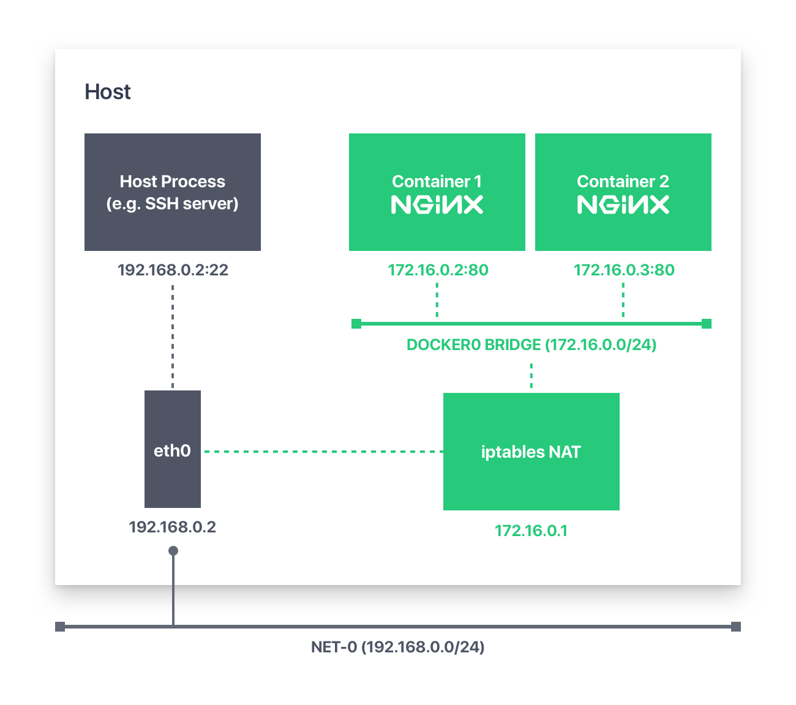
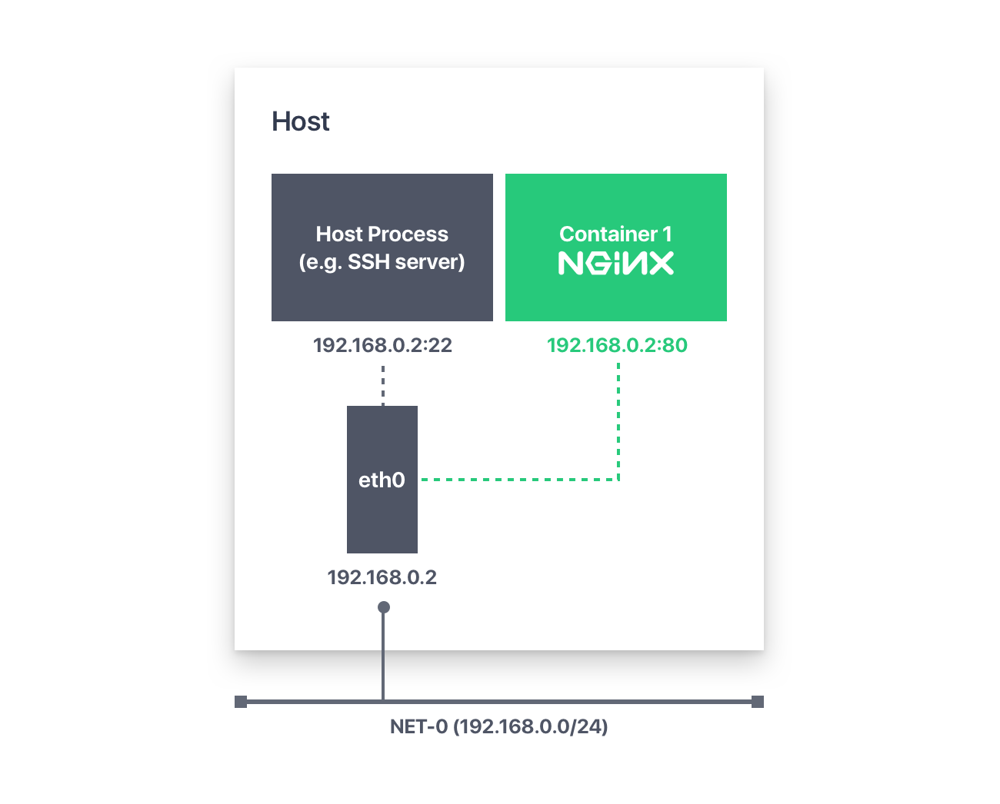

# Introducción

El desarrollo tradicional ha sido siempre en un entorno local donde
instalamos las librerías necesarias y archivos de configuración. Esta forma
siempre ha tenido el inconveniente de que estaba unida al sistema en
ejecución. Para salvar esta situación tenemos dos opciones: **máquinas
virtuales** y **contenedores**.

{width=90%}


# Ventajas de usar contenedores

Los contenedores LXC son un concepto relativamente antiguo y utilizado desde hace tiempo por grandes empresas como Amazon o Google, pero cuyo gestión era complicada. Sin embargo, Docker define APIs y herramientas de línea de comandos que hacen casi trivial la creación, distribución y ejecución de contenedores.

* Bajos recursos de hardware
* Entorno de trabajo aislado
* Rápido despliegue
* Múltiples entornos de trabajo
* Utilización en arquitecturas de microservicios


# Conceptos fundamentales de Docker

Docker automatiza el despliegue de aplicaciones dentro de contenedores, proporcionando una capa adicional de abstracción y automatización de virtualización de aplicaciones.


Algunos conceptos fundamentales:

* **Imagen**: modelo de lo que queremos construir. Se contruyen a partir de *Dockerfiles*.
* **Contenedor**: instanciación de una imagen que puede estar totalmente aislada del resto de contenedores.
* **Dockerfile**: conjunto de instrucciones que nos permite construir una imagen.
* **Layers**: cualquier modificación de una imagen se verá reflejada por la adición de capas a dicha imagen.


# Arquitectura Docker

* **Docker client**: herramienta en línea de comandos responsable de comunicarnos con el servidor o *demonio* Docker.
* **Docker Server o Daemon**: realiza el trabajo de construir, ejecutar y descargar imágenes. El demonio puede estar instalado en la misma máquina local o podemos estar haciendo uso de uno remoto.
* **Registro**: los registros almacenan imágenes para uso público o privado. Dichos registros suelen estar en remoto pero también pueden estar en local.


{width=80%}


# Comando comunes

| Comando           | Descripción                                                |
| ----------------- | :--------------------------------------------------------- |
| docker run        | Crea un contenedor a partir de una imagen                  |
| docker inspect    | Información acerca de un contenedor o imagen               |
| docker start/stop | Arranca o detiene un contenedor                            |
| docker rmi/rm     | Borra una imagen (rmi) o un contenedor (rm)                |
| docker exec       | Ejecuta comandos dentro de un contenedor                   |
| docker logs       | Nos da información (logs) acerca de un contenedor lanzado. |
| docker cp         | Copia ficheros de dentro de un contenedor.                 |

# Comandos utilizados en la construcción de Dockerfiles

- `FROM`: inicia el sistema de ficheros para el contenedor. A la vez nos provee de un gestor de paquetes que será específico de la distribución Linux o *Windows*, utilizada.
- `RUN`: ejecuta un comando en el contexto de la imagen.
- `VOLUME`: define un volumen en el contenedor.
- `WORKDIR`: directorio de trabajo en el contenedor.
- `COPY <origen> <destino>`: copia ficheros dentro de la imagen.
- `EXPOSE`: nos permite definir puertos donde el contenedor acepta conexiones. Este parámetro no abrirá conexiones con el *host*, para ello tendremos que especificar dicho puerto a la hora de lanzar el contenedor.
- `ENTRYPOINT`: define el comando por *defecto* que ejecuta el contenedor al arrancar.
- `CMD`: define los distintos parámetros que ejecuta el contenedor al arrancar.


# Construcción de imágenes

Las imágenes son construidas a través del comando `docker build` y mediante la utilización de un fichero denominado **Dockerfile**.

```dockerfile
FROM ubuntu:bionic
RUN apt-get update -y
RUN apt-get install -y python-pip python-dev
WORKDIR /app
VOLUME /app
COPY . /app
RUN pip install -r requirements.txt
ENTRYPOINT ["python"]
CMD ["app.py"]
```

Una vez creado nuestro **Dockerfile** ejecutamos la siguiente orden:

```bash
docker build -t <nombre_imagen> .
```


# Lanzando contenedores

Una vez que nuestra imagen está lista podemos lanzar contenedores a través de ella.

```bash
docker run --rm --name <nombre> -d -i -t
-v <ruta_local>:<ruta_contenedor>
-p <puerto_local>:<puerto_contenedor>
-e <variables_entorno> <nombre_imagen> <posible_comando>
```

Algunos parámetros:

* `-d`  nos permite que el contenedor se lance en segundo plano y se mantenga en ejecución.
* `-it`: nos permite crear una terminal interactiva dentro del contenedor.
* `-v`: para montar volúmenes.
* `-p`: asigna un puerto de nuestra máquina local a un puerto de nuestro contenedor.
* `-e`: permite definir variables de entorno necesarias para el correcto funcionamiento.


# Docker Compose

Docker Compose viene a sustituir los comandos anteriores, `docker build` y `docker run`. Docker Compose busca un archivo denominado por defecto `docker-compose.yml` y ejecutará una serie de instrucciones que nos permitirán definir nuestros contenedores. 

Docker Compose hace más cómoda la gestión de los contenedores, ya que con un solo comando podemos lanzar muchos servicios o contenedores.

Docker Compose también nos permite crear redes y volúmenes para los contenedores. Por defecto creará una red independiente para los contenedores o servicios que se ejecuten dentro de un mismo archivo `.yml`.

A la vez, Docker Compose puede tener sus propios parámetros, los cuales no podemos revisar todos uno por uno.


# Ejemplo de Docker Compose

```yaml
version: '3'
services:
	db:
		image: mysql:5.7
		restart: always
		environment:
			MYSQL_ROOT_PASSWORD: password
	wordpress:
		image: wordpress:latest
		depends_on:
			-	db
		ports:
			-	"8000:80"
```


# Volúmenes

Cuando lanzamos un contenedor este puede generar información. Dicha información se perderá en el momento en el que se elimine dicho contenedor. Para evitar este problema de persistencia de datos creamos los denominados **volúmenes**.

Dichos volúmenes nos permiten guardar la información y que esta no se pierda, e incluso que otros contenedores puedan hacer uso de ella si así lo indicamos.

Veremos que existen dos tipos de volúmenes:

* **Volúmenes de host**
* **Volúmenes de datos**

# Volúmenes de host

{ width=70% }

Para montar volúmenes de host tendremos que especificar la ruta completa de la carpeta host. Generalmente esto se hace con el atajo `$PWD` que nos da la ruta completa de nuestro directorio de trabajo. Un ejemplo de ejecución sería:

```bash
docker run --rm --name mysqldev 
-v "$PWD"/data:/var/lib/mysql -dit 
-p 3306:3306 -e MYSQL_ROOT_PASSWORD=1234 mysql:lastest
```

# Volúmenes de datos

{ width=70% }

A diferencia de los volúmenes de host, los volúmenes de datos son creados y gestionados por Docker. Estos volúmenes permiten la persistencia de datos, y además, la comunicación entre contenedores.

```bash
docker volume create lamp

docker run --rm --name mysqldev_p 
-v lamp:/var/lib/mysql -dit 
-p 3306:3306 -e MYSQL_ROOT_PASSWORD=1234 mysql:lastest
```

# Redes

Docker también nos permite crear y gestionar redes. Esto facilita la configuración de redes entre contenedores y las comunicaciones entre ellos, y las comunicaciones entre contenedores y la máquina host.

En Docker tenemos 3 tipos de redes:

* **Bridge**
* **Host**
* **None**

El siguiente comando nos permite gestionar las redes:

```bash
docker network --help
```

# Red bridge

{ width=90% }

# Red host

{width=90%}